# 目次
1. [画面の説明](#1-画面の説明)
2. [機能の説明](#2-機能の説明)
    1. [メニューバー](#2-1-メニューバー)
    2. [マシンビュー](#2-2-マシンビュー)
    3. [メモリ、レジスタ](#2-3-メモリレジスタ)
    4. [ツールバー](#2-4-ツールバー)
3. [基本的な使い方](#3-基本的な使い方)
    1. [自分で作ったプログラムを実行する](#3-1-自分で作ったプログラムを実行する)
    2. [デバッグする](#3-2-デバッグする)
    3. [シミュレータ上でプログラムを作成する](#3-3-シミュレータ上でプログラムを作成する)
4. [注意点](#4-注意点)

---

# 1. 画面の説明
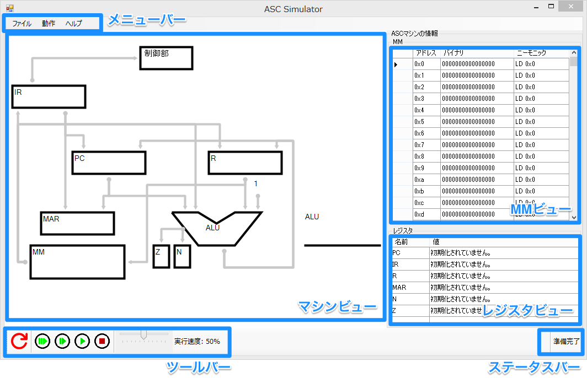

[2. 機能の説明](#2-機能の説明)にて、各部の詳しい説明をします。

# 2. 機能の説明
## 2-1. メニューバー
## ファイル
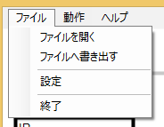

#### [ファイルを開く]
asc-assembler.exeやasc-simulator.exeの出力した.ascoファイルを選択し、メモリに読み込みます。

またこの時、.ascsファイルで設定したORGの値がPCに設定されます。

#### [ファイルへ書き出す]
MMの内容を.ascoファイルへ書き出します。

ここで書き出すファイルは、asc-assembler.exeの書き出すファイルと互換性があります。

#### [環境設定]
マシンビューの設定など、細かな設定をすることができます。

## 動作
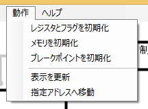

#### [レジスタとフラグを初期化]
レジスタ、フラグの値を0に設定します。

後述する[[初期化ボタン]](#初期化)との違いは、命令サイクルの状態を変更しないことです。

#### [メモリを初期化]
メモリの内容を0で初期化します。

#### [ブレークポイントを初期化]
ブレークポイントを全て解除します。

#### [表示を更新]
マシンビューの表示、MMの表示、レジスタの表示を更新します。
表示に不具合のある場合などに使用してください。

#### [指定アドレスへ移動]
押すと、以下のようなダイアログが表示されます。

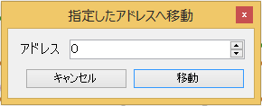

表示したいアドレスを入力し、[**移動**]を押すことで、MMの表示を指定したアドレスまでスクロールすることができます。

## ヘルプ
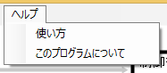
### [使い方]
このページを表示します。

### [このプログラムについて]
プログラムのバージョンなどを確認することができます。

## 2-2. マシンビュー
ASCマシンの状態を確認することができます。

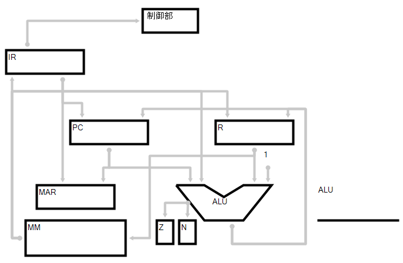

### 色について
マシンビューにおいて、値の書き換え、値の参照などが発生した場合、色が変わることがあります。

**緑色**はその部分において、**参照が発生**したことを表しています。

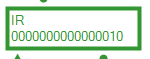

**オレンジ色**は**書き換えが発生**したことを表しています。

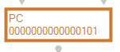

また、色のついた矢印は、**値が移動したこと**を表しています。

## 2-3. メモリ、レジスタ
### MMビューの見方
画面右の[**MM**]という表に、ASCマシンのMMの内容が表示されます。

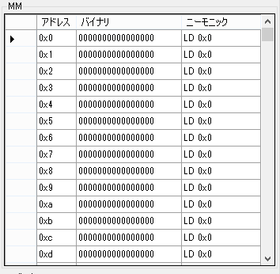

MMビューには**アドレス**、**バイナリ**、**ニーモニック**の順に値が表示されており、

**バイナリ**列にはMMの内容の**二進数表示**が、
**ニーモニック**列にはMMの内容の**逆アセンブル**が表示されています。

 _(ただし、ここで表示されている**ニーモニック**はあくまでもMMの逆アセンブルです。
   .ascsファイルで定数とした値も、
   シミュレータ上では命令として解釈され表示されることに注意してください。)_

### MMビューの色について
MMビューの行が着色されるときがあります。

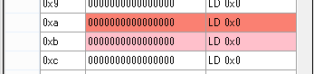

**濃い赤**は**現在実行している命令の内容**を表しており、

**薄い赤**は**PCの指すアドレスの命令の内容**を表しています。

### MMの内容を変更する
**バイナリ**、**ニーモニック**の列は、クリックすることで直接書き換えることができます。

値を入力した後、**Enterを押すか、他の行をクリックすること**でMMへ反映することができます。

書式にエラーがあった場合は、**赤い**マークが表示されます。

この**赤い**マークにマウスオーバーすることでエラーの内容を確認することができます。

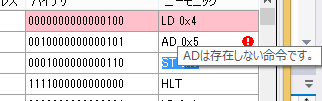

### ブレークポイントを設定する
[**MM**]のアドレスの左にある列をクリックすることで、**ブレークポイント**を設定できます。

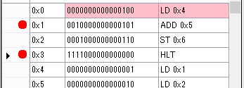

ブレークポイントとは、[デバッグ](#3-2-デバッグする)の際などに、指定したアドレスで自動的に実行を停止する機能です。

ブレークポイントが設定されたアドレスは、左側に**赤い丸**が表示されます。

この**赤い丸**をもう一度クリックすることで、ブレークポイントを解除することができます。

また、メニューバーより[**動作**]→[**ブレークポイントを初期化**]機能より、全てのブレークポイントを解除することもできます。→_[ブレークポイントを初期化](#ブレークポイントを初期化)_

---

### レジスタビューの見方
画面右下に表示されている[**レジスタ**]という表に、レジスタとフラグの値が表示されます。

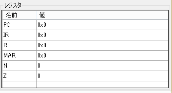

**名前**、**値**の列にそれぞれ、**レジスタ名**と**レジスタの値**が表示されています。

### レジスタの内容を変更する
**値**列はクリックすることで編集することができます。

**Enterを押すことや、他の行をクリックすること**で編集内容をレジスタに反映することができます。

入力にエラーがあった場合は、**赤い**マークが表示されます。

この**赤い**マークにマウスオーバーすることでエラーの内容を確認することができます。

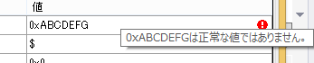

## 2-4. ツールバー
画面下部のツールバーには、ASCマシンの動作を操作するボタンなどが配置されています。

### 初期化

ASCマシンの**レジスタとフラグの値を0に設定**し、**命令サイクルの冒頭に戻ります。**

メニューバーにある、[[レジスタとフラグを初期化]](#レジスタとフラグを初期化)との違いは、
命令サイクルを冒頭に戻す機能が追加されていることです。

プログラムを実行しなおす際などには、基本的にはこちらを使用してください。

### 通常実行

ASCマシンを、**HLT命令**か**ブレークポイント**があわられるまで実行します。

手動で停止する際は、後述する[[**ブレーク**]](#ブレーク)ボタンを使用してください。

### 命令単位ステップラン

ASCマシンを、**次の命令まで実行して停止します。**

### 状態単位ステップラン

ASCマシンを、**次の状態まで実行して停止します。**

### ブレーク

通常実行時に**実行を（強制的に）中断し停止します。**

---

### 実行速度コントローラ

スライダを調節することで、**[通常実行]ボタン**を押した際の**ASCマシンの実行速度を調節できます。**

実行速度を遅くすることで、処理の内容を追いやすくなります。

また、処理に時間のかかるプログラムなどは、実行速度を速めることで高速に実行することができます。

# 3. 基本的な使い方
## 3-1. 自分で作ったプログラムを実行する
このシミュレータは、同封のasc-assembler.exeの出力する、.ascoファイルを読み込むことができます。

以下に、このシミュレータを使ってプログラムを実行する手順を示します。

1. [**初期化**]**ボタン**を押す。
2. メニューバーより、[**ファイル**]→[**ファイルを開く**]を押す。
3. 読み込みたいファイルを選択し、[**開く**]を押す。
4. 画面下部のステータスバーで、読み込みの成功を確認する。
5. [**通常実行**]ボタンを押す。

以上の手順で、プログラムを実行することができます。

**(2, 3の手順を、ファイルをドラッグ&ドロップすることによって代用することもできます。)**

## 3-2. デバッグする

読み込んだプログラムをデバッグするための手順を、以下に示します。

1. 動作を確認したいアドレスに、ブレークポイントを設定する。→
_[ブレークポイントを設定する](#ブレークポイントを設定する)_
2. [**通常実行**]**ボタン**を押す。
3. ブレークポイントで停止するので、[**命令単位ステップラン**]**ボタン**や
[**状態単位ステップラン**]**ボタン**を使い、動作を確認する。
4. バグを確認したら、MMの該当のアドレスを書き換える。→ _[MMの内容を変更する](#mmの内容を変更する)_
5. [**初期化**]**ボタン**を押して、レジスタとフラグを初期化する。
6. PCの値をプログラムの初期位置に変更し、手順2へ戻る。→ _[レジスタの内容を変更する](#レジスタの内容を変更する)_

バグの改善が確認できるまで、この操作を繰り返してください。

ブレークポイントで停止している間に、RやZ, Nなどの値を変更することも、バグの特定につながります。

## 3-3. シミュレータ上でプログラムを作成する

[MMの変更機能](#mmの内容を変更する)により、シミュレータ上でプログラムを作成することも可能です。

以下に、その手順を示します。

1. MMが初期化されていることを確認する。→ _[メモリを初期化](#メモリを初期化)_
2. MMの内容を書き換え、プログラムを作成する。→ _[MMの内容を変更する](#mmの内容を変更する)_
3. PCの値をプログラムの開始位置に設定する。→ _[レジスタの内容を変更する](#レジスタの内容を変更する)_
4. [**通常実行**]**ボタン**を押し、動作を確認する。
5. デバッグをする。→ _[3-2. デバッグする](#3-2-デバッグする)_
6. メニューバーより、[**ファイル**]→[**ファイルへ書き出す**]を押し、プログラムを保存する。

ここで書き出した.ascoファイルは、asc-assembler.exeの出力するファイルと互換性があるため、再びシミューレータで読み込むことができます。

# 4. 注意点
* メモリの内容を書き出す際、0番地から書き出されます。
* メモリの内容を書き出したファイルのサイズは、変更されているメモリの最後の番地の、
次の2の倍数byteになります。(例えば、メモリの使用が0xF0〜0xFF番地までの場合、128byteになります)
* 実行中は、メモリ、レジスタの値は変更することができません。
* ADD、SUB命令によりオーバフローが発生した場合、マシンはブレークし、「オーバフローが発生しています」と表示します。
